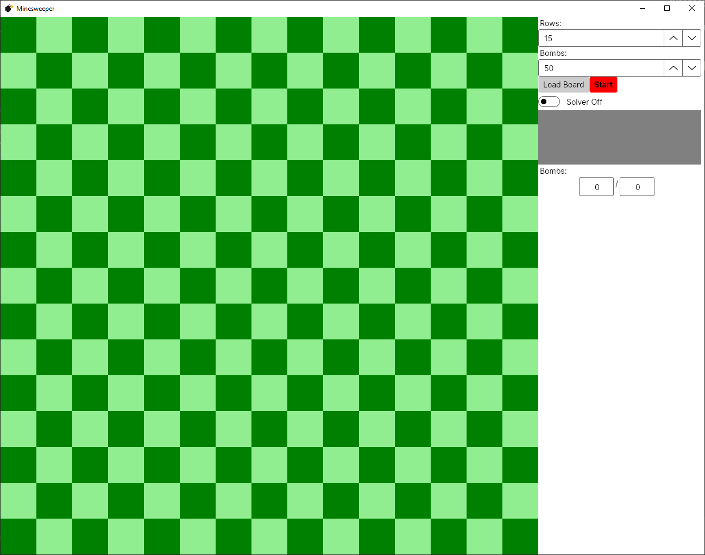
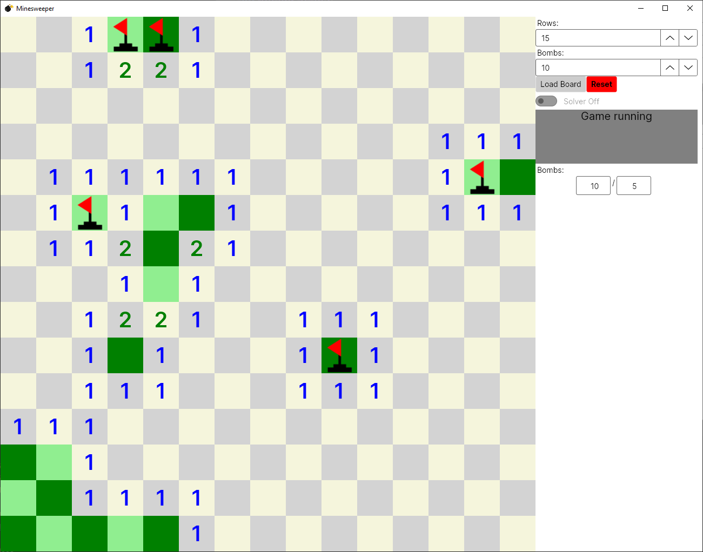
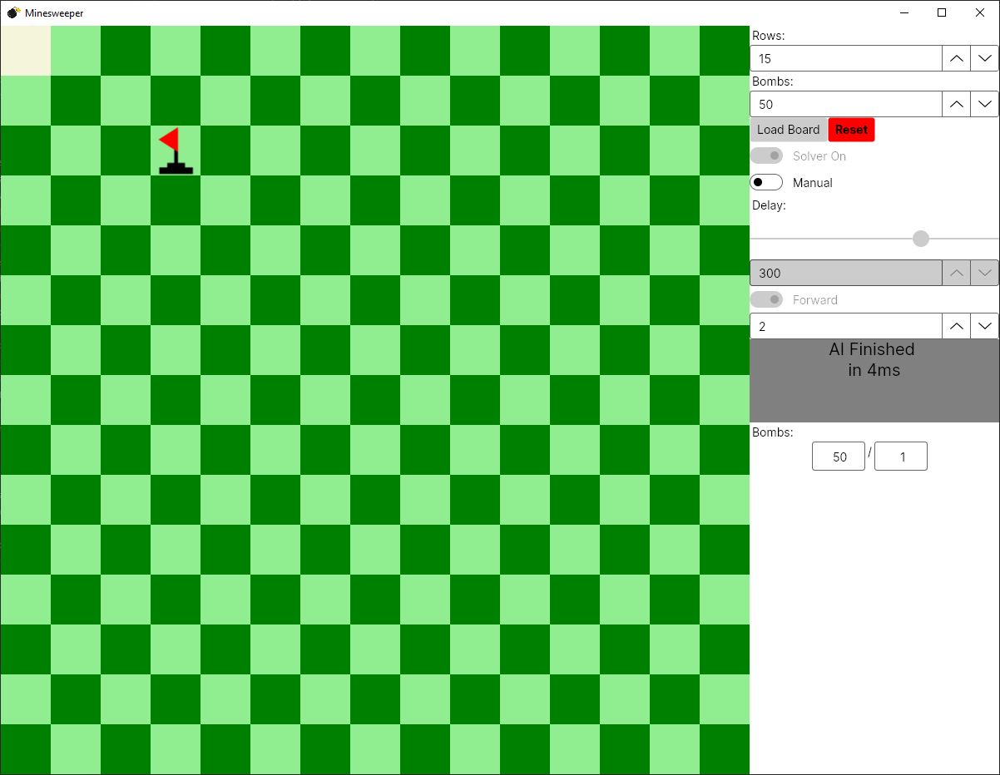
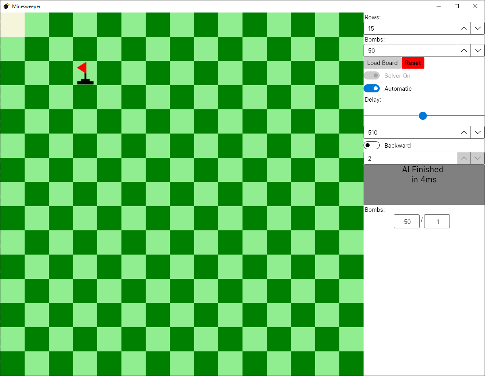

# Minesweeper

A simple Minesweeper made with C# and avalonia.<br>
You can write your own Minesweeper solver and see every step it makes over the GUI. You can also fully customize the
number of fields and the number of bombs you want to play with.

## Overview

- [Minesweeper](#minesweeper)
    - [Overview](#overview)
    - [GUI](#gui)
        - [Rows](#rows)
        - [Bombs](#bombs)
        - [Load Board](#load-board)
        - [Start/Reset](#startreset)
        - [Infotext](#infotext)
        - [Bombs and flag indicator](#bombs-and-flag-indicator)
        - [Solver toggle](#solver-toggle)
        - [Manual/Automatic toggle](#manualautomatic-toggle)
        - [Forward/Backwards toggle](#forwardbackwards-toggle)
        - [Flagging](#flagging)
        - [Uncover](#uncover)
        - [Uncover surrounding](#uncover-surrounding)
    - [Solver](#solver)
        - [Description](#description)
        - [How to](#how-to)
            - [Start solver](#start-solver)
            - [Access fields](#access-fields)
            - [Predefined variables solver](#predefined-variables-solver)
            - [Predefined variables field](#predefined-variables-field)
            - [Uncover](#uncover-1)
            - [Flag](#flag)
            - [UnFlag](#unflag)
            - [DON'T USE!](#dont-use)
        - [Concept](#concept)

## GUI

The whole program is divided in two sections on the left is the board and on the right are the controls and the info
text.



### Rows

here you can define the number of rows and amount of columns of the board. The maximum is 100 which translates to 10'000
fields. It is not recommended to use so many fields. The minimum is 5 which translates to 25 fields. <br/>
you'll have to click the Load Board button to apply the settings. This button only works while the game is not running.

### Bombs

here you can define the number of bombs on the field. The minimum amount is always 5 and the maximum is 1/2 of the
number of fields. <br/>
you'll have to click the Load Board button to apply the settings. This button only works while the game is not running.

### Load Board

Applies the settings from [Bombs](#bombs) and [Rows](#rows) if the game is not running

### Start/Reset

The start button is named "Start" if the game is not running and it is named "Reset" if the game is running.



### Infotext

This grey box contains information about the game. For example, if the game is running or if it is over.

### Bombs and flag indicator

The left text box contains the number of bombs currently on the field. The right box contains the number of flags
currently set on the field.

### Solver toggle

This switch activates the [Solver](#solver).



### Manual/Automatic toggle

This switch changes the mode in which you can navigate the steps the solver made. In manual, you have to specify exactly
which step you want to execute. While in automatic, you can only control the speed at which the program goes through the
steps and the direction.



### Forward/Backwards toggle

This switch is only available if you are using the automatic mode. With this, you can change the direction through which
the program is iterating.

### Flagging

You can flag a field by right-clicking it. This only works if the field is covered and if the game is running.

### Uncover

You can uncover a field by left-clicking it. This only works if the field is covered and if the game is running.

### Uncover surrounding

You can uncover all surrounding fields of a field. If the field has the same value as the number of flags surrounding
it.

## Solver

### Description

The solver is a file in which you have a few things that you can do for example you can uncover, flag and unflag a
field. The idea is, that you are writing your own minesweeper solver. You can then see every step your solver made with
the GUI's help.

### How to

You have a few predefined functions and variables which you can use to write your own solver.

#### Start solver

This simulates the first click on the board. On the defined point won't be a bomb

```C#
PlaceBombs(new Point(0, 0));
```

#### Access fields

All these ways return the same result it is your choice which one you use.

The "!" says, that we are sure, that the method will not return null. It will return null if it cannot find the field.

```C#
GetField(2, 3)!; // Returns a Field
```

```C#
GetField(new Point(2, 3))!; // Returns a Field
```

```C#
Fields[2, 3]; // Returns a Field
```

#### Predefined variables solver

The number of bombs on the board

```C#
AmountBombs; // Readonly
```

The number of rows or columns of the board.

```C#
RowsAmount; // Readonly
```

This variable is set to true if the user clicked cancel. You need to stop your solver by your self, if this token is set to true, if you want the cancel button to work.
```C#
IsCanceled; // Readonly
```

If this is set to false, then no moves will be added until it's true again.
```C#
AddMoves; 
```
#### Predefined variables field

Whether the field is flagged or not

```C#
Field field = GetField(2, 3)!;
field.IsFlagged; // Readonly
```

Whether the field is covered or not

```C#
Field field = GetField(2, 3)!;
field.IsCovered; // Readonly
```

The fields value. In other words the number of bombs surrounding the field.

```C#
Field field = GetField(2, 3)!;
field.Value; // Readonly
```

#### Uncover

returns true if the field is uncovered after the execution.<br>
returns false if the field could not be uncovered because it was flagged.<br>
throws a BombUncoveredException if a bomb was uncovered.<br>
DON'T CATCH THIS ERROR!

```C#
Field field = GetField(2, 3)!;
field.Uncover(); // Returns bool
```

#### Flag

returns true if the field is flagged after the execution.<br>
returns false if the field could not be flagged because it was uncovered.

```C#
Field field = GetField(2, 3)!;
field.Flag(); // Returns bool
```

#### UnFlag

returns true if the field is now unflagged.<br>
returns false if the field could not be unflagged because it was uncovered.

```C#
Field field = GetField(2, 3)!;
field.UnFlag(); // Returns bool
```

#### DON'T USE!

DON'T use this function it is only useful if you are cheating.

```C#
Field field = GetField(2, 3)!;
field.GetAsCreationField();
```

### Concept

The solver creates a simulation board on top of which you can write your code. This makes everything way more efficient.
But the biggest advantage is, that we can follow every step the solver does with ease.
